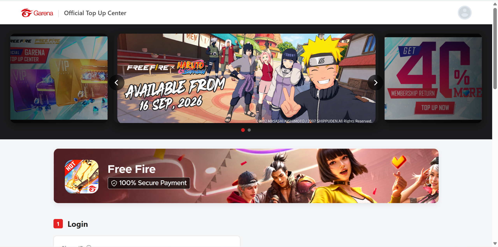
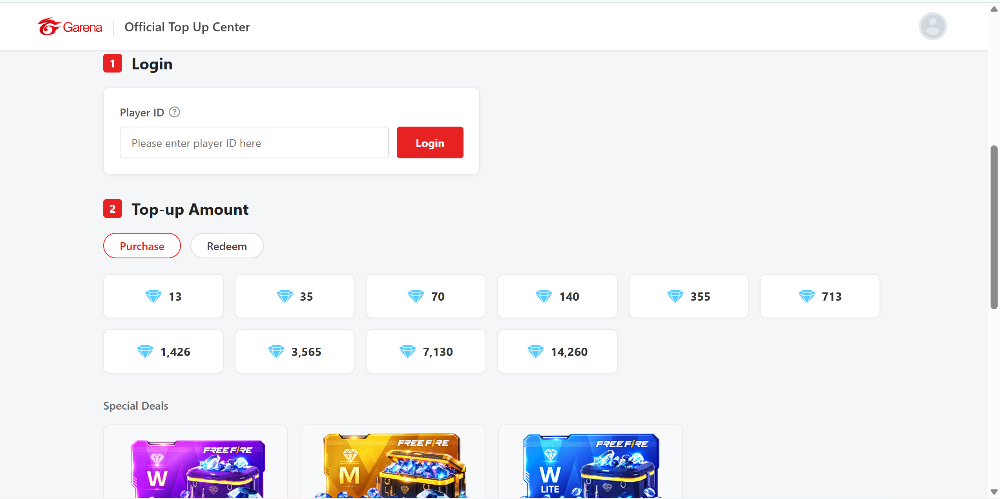
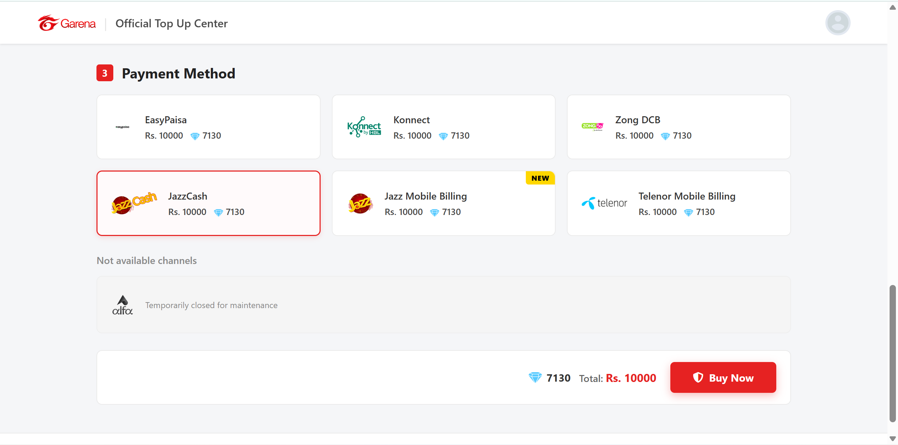
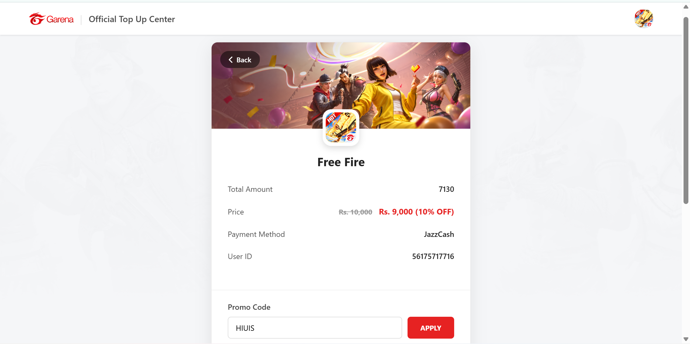
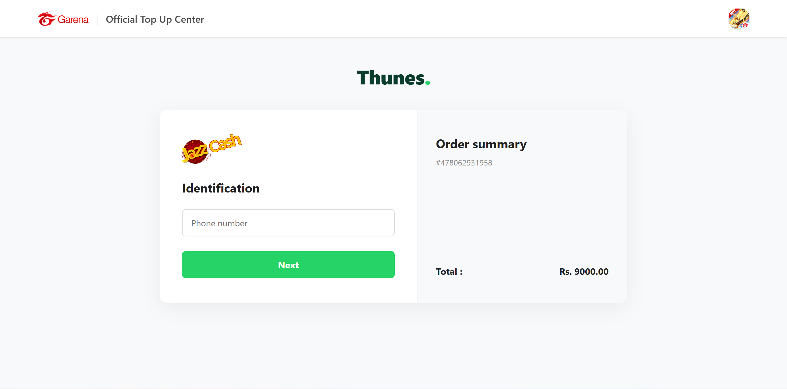
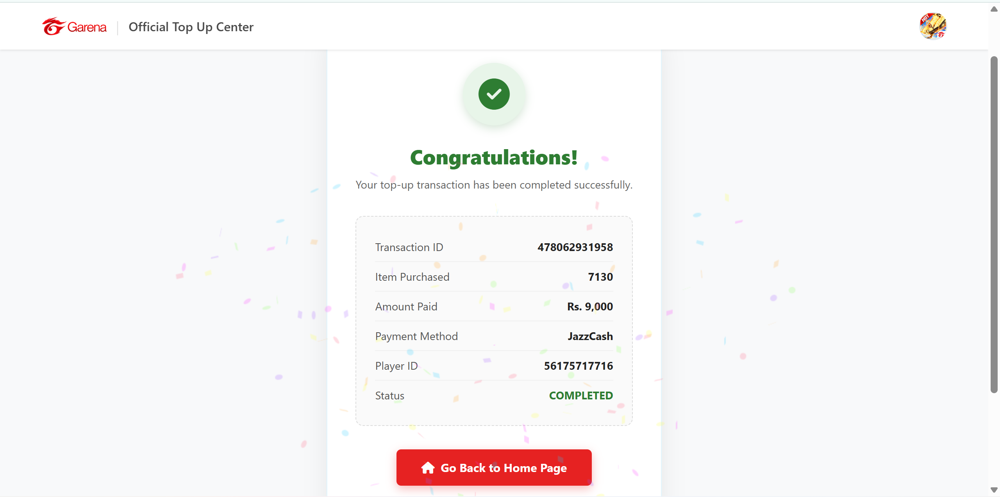

# Free Fire Top-Up UI Prototype

A multi-page frontend recreation of a Garena-style Free Fire top-up website, built with HTML, CSS, and vanilla JavaScript. This project demonstrates product selection, browser state, checkout screens, and a simulated transaction flow.

**This is an independent learning project, not an official Garena service. It does not process payments or deliver diamonds.** Brand names, logos, and the reference interface belong to their respective owners. References to an "Official Top Up Center" inside the recreated pages are part of the reference UI, not an affiliation claim.

## Features

- Promotional banner carousel with navigation and automatic rotation.
- Player ID entry, a sample account display, and browser-persisted demo login state.
- Diamond packages, membership cards, and level-up package selection.
- Purchase and prepaid-card tabs with a simulated redemption interaction.
- Payment-method selection and a checkout summary.
- Checkout with contact fields and a demo discount interaction.
- Payment-method-specific gateway screens.
- Pending transaction screen followed by a simulated success receipt.
- Separate FAQ, Help Center, Terms, and Privacy pages.
- CSS media queries for smaller screens; verify the actual layout on target devices.

## Technology

HTML5, CSS3, vanilla JavaScript, and browser `localStorage`. Font Awesome icons and the receipt confetti animation load from external CDNs.

There is no backend, database, API integration, npm dependency installation, or build step.

## Run locally

Open the project folder in VS Code and use **Open with Live Server** on `index.html` if the Live Server extension is installed. Keep all pages on the same local server address so they share browser storage.

Alternatively, with Python installed, run this in the project folder:

```powershell
py -m http.server 5500 --bind 127.0.0.1
```

Open `http://127.0.0.1:5500`. If the Python launcher is unavailable, use `python` in place of `py`. Stop the server with `Ctrl+C`. Internet access is needed for the external CDN assets.

## Try the demo

1. Enter a dummy 10- or 11-digit Player ID, for example `1234567890`.
2. Choose a diamond or membership package and a payment method.
3. Click Buy Now and fill in sample checkout details, such as `Demo User` and `demo@example.com`.
4. Optionally enter `DEMO1` to apply the demo 10% discount.
5. Continue to the simulated gateway and use a dummy mobile number.
6. Continue to the pending page; a success receipt appears after five seconds.

Use sample information throughout this prototype.

## Demo limitations

- Player ID entry checks only the input format. No game account is verified, and the displayed username is hardcoded.
- Any five-character promo code applies a 10% discount once on the current checkout page. There is no voucher service.
- Prepaid-card redemption displays a success alert for a nonempty code; no actual redemption occurs.
- Gateway screens do not contact payment providers, charge money, or send SMS confirmations.
- The success receipt is triggered by a timer, not by a payment result. Reference numbers are generated in the browser.
- Package prices are sample values. Payment-method modifiers in the markup are not used to calculate different totals.
- Checkout contact fields are checked for presence; the checkout button does not validate email format.
- Demo login and checkout details, including name and email, are stored in browser storage. Logout removes the login ID but leaves checkout data. Clear this site's storage to reset everything.
- FAQ, Help Center, Terms, and Privacy content is illustrative reference content, not documentation of a running service.

## Project structure

| Path | Purpose |
| --- | --- |
| `index.html` | Package selection, payment methods, and login UI |
| `script.js` | Homepage interactions and checkout navigation |
| `style.css` | Shared styling and media queries |
| `checkout.html` | Checkout details and demo promo code |
| `payment-gateway.html` | Simulated gateway screen |
| `transaction-status.html` | Pending and simulated success screens |
| `faq.html`, `help-center.html` | Reference information pages |
| `terms.html`, `privacy.html` | Illustrative policy pages |
| `images/` | Local image assets |
| `check-assets.ps1` | Checks statically referenced image paths and capitalization |

## Check image assets

From the project folder in PowerShell:

```powershell
powershell -NoProfile -ExecutionPolicy Bypass -File .\check-assets.ps1
```

This checks image filenames and their capitalization. It does not test image rendering, responsiveness, or the checkout flow. Open the project in a browser to verify those separately.

## Learning context

This frontend practice project was developed with AI assistance. It is presented as a UI recreation and simulated user flow, rather than an original Garena design or a production payment system.

Author: [Muhammad Amir](https://github.com/amirownsthis-code), Data Science student at UET Main Campus Lahore.

## Screenshots

### Homepage


### Diamond Packages


### Payment Methods


### Checkout


### Demo Payment Gateway


### Simulated Success Receipt
